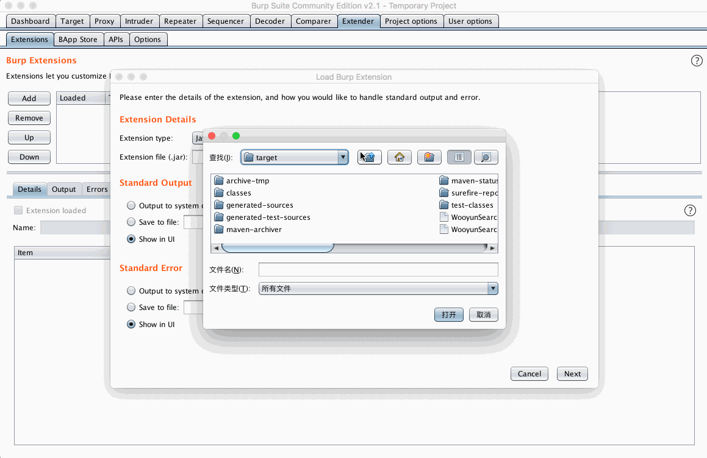

# WooYun-Payload
从乌云漏洞库中提取的扫描规则

## Burpsuite 辅助插件
通过http请求包中域名，路径，参数等获取乌云历史漏洞中类似的数据。

## 数据说明

- data 从乌云镜像中提取的各类字典
- WooyunSearch burp插件源码
- 编译好的burp插件下载地址 https://github.com/boy-hack/wooyun-payload/releases

